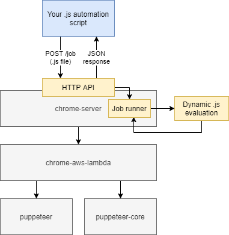

[](https://github.com/function61/chrome-server/releases)

Chrome automation microservice for AWS Lambda.



Contents:

- [Installation](#installation)
- [Minimal test example](#minimal-test-example)
- [How to submit jobs](#how-to-submit-jobs)
- [Local automation script dev](#local-automation-script-dev)
- [Security](#security)
- [Credits](#credits)


Installation
------------

Just plop the `lambdafunc.zip` from the download link into AWS Lambda.

Then set up AWS API Gateway or [Edgerouter](https://github.com/function61/edgerouter) as
the HTTP ingress.

Our [base project](https://github.com/alixaxel/chrome-aws-lambda) recommends allocating at
least 1 600 MB RAM. You know the
[memes about Chrome and RAM](https://knowyourmeme.com/memes/google-chrome-ram-hog)..

You should also increase timeout in Lambda from default. I used 2 minutes for timeout but
your needs may vary.


Minimal test example
--------------------

Save as `script.js`:

```javascript
exports.handler = async (ctx, console, browser) => {
	console.log('example log message')

	ctx.data = {
		message: 'hello world',
	};
}

```

Now run the `$ curl` command (from "How to submit jobs"). You should see this:

```console
$ curl ...
{
  "logMessages": [
    "example log message"
  ],
  "errorMessages": [],
  "data": {
    "message": "hello world"
  },
  "error": null
}
```

Now let's actually do something with Chrome. Modify `script.js`:

```javascript
exports.handler = async (ctx, console, browser) => {
	const page = await browser.newPage();

	await page.goto('https://www.reddit.com/');

	ctx.data = {
		title: await page.title(),
	};
}
```

Running it:

```console
$ curl ...
{
  "logMessages": [],
  "errorMessages": [],
  "data": {
    "title": "reddit: the front page of the internet"
  },
  "error": null
}
```


How to submit jobs
------------------

Example with `curl` and authorization (you can use anything as token, if you haven't set
up authorization):

```console
$ curl --data-binary "@script.js" -H 'Authorization: Bearer ...' -H 'Content-Type: application/javascript' https://example.com/api/chromeserver/job
```


Local automation script dev
---------------------------

When developing a complex script, it's very useful to be able to test it locally (think:
getting screenshots when you encounter an error).

First, meet [Turbo Bob](https://github.com/function61/turbobob/blob/master/docs/external-how-to-build-and-dev.md).

Then:

- enter dev container
- test your script

It looks like this:

```console
$ bob dev
$ ./devrunner.js script.js
{
  logMessages: [],
  errorMessages: [],
  data: { title: 'reddit: the front page of the internet' },
  error: null
}
```

(if it complains about `$ npm install`, run it)

The `devrunner.js` gives you same output as you would get from Lambda over HTTP.

Note: after doing local dev, if you build `chrome-server`, your `lambdafunc.zip` will be
larger (and above the Lambda's limit) because of additional `node_modules`. But usually
you won't develop your job scripts and **change** `chrome-server` at the same time. :)


Security
--------

Since this service evaluates user-sent JavaScript, you need to trust the API users.

Have the API be protected via authorization in AWS's API Gateway or in
[Edgerouter](https://github.com/function61/edgerouter).

Don't give the Lambda function any privileges beyond what is needed to run Lambda.


Credits
-------

This is a small decoration on top of
[alixaxel/chrome-aws-lambda](https://github.com/alixaxel/chrome-aws-lambda). He's done
amazing work!
